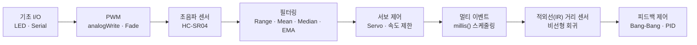

<div align="center">

# 🛠️ 창의공학설계

[English](README.md) | 한국어

**Arduino 수업 자료 아카이브**

수업에서 다룬 Arduino 예제·실습·과제 스케치를 한 곳에 모은 인덱스 레포입니다.<br/>
LED·PWM 부터 초음파/적외선 센서, 서보 제어, 필터링, Bang-Bang & PID 까지의 흐름을 따라갑니다.

<br/>


-00599C?logo=cplusplus&logoColor=white)


</div>

---

## 📑 목차

- [소개](#-소개)
- [하드웨어 및 툴체인](#-하드웨어-및-툴체인)
- [저장소 구조](#-저장소-구조)
- [주차별 인덱스](#-주차별-인덱스)
- [빠른 시작](#-빠른-시작)
- [공통 규칙](#-공통-규칙)
- [과제 노트](#-과제-노트)
- [면책 사항](#-면책-사항)
- [저자](#-저자)

---

## 🧭 소개

본 저장소는 **창의공학설계(Creative Engineering Design)** 강의에서 진행한 주차별 Arduino 실습/예제/과제 스케치를 폴더 단위로 보관합니다.
강의 흐름은 대체로 다음과 같이 진행됩니다.



> 각 스케치는 단일 `.ino` 파일이며, 폴더명에서 학습 단위(주차/예제/과제)를 추론할 수 있도록 구성되어 있습니다.

---

## 🔌 하드웨어 및 툴체인

| 항목 | 내용 |
|---|---|
| 보드 | Arduino UNO (ATmega328P, `arduino:avr:uno`) |
| 주요 부품 | HC-SR04 초음파 센서, Sharp IR 거리 센서, SG90/MG-급 서보, LED, 가변저항(Potentiometer) |
| 라이브러리 | 표준 `Arduino.h`, `Servo.h` (서보 사용 스케치에 한함) |
| 시리얼 속도 | 스케치별 상이 (`57600`, `115200`, `1,000,000`, `2,000,000` 사용) |
| IDE | [Arduino IDE](https://www.arduino.cc/en/software) 또는 [arduino-cli](https://arduino.github.io/arduino-cli/) |

> 핀 배치(LED 9, TRIG 12, ECHO 13, SERVO 10, IR A0, VAR A3 등)는 각 스케치 상단 `#define` 블록에 명시되어 있습니다. 회로를 결선하기 전에 해당 정의를 먼저 확인하세요.

---

## 🗂 저장소 구조

```
Creative_Engineering_Design/
├── 04_example_1/                # 디지털 출력 기초 (LED)
├── 04_example_2/                # 시리얼 출력 ("Hello World")
├── 04_example_3/                # LED 토글 + 카운터
├── 05_practice_2/               # LED 점멸 패턴 실습
├── pwmpractice/                 # PWM 페이드 (analogWrite)
├── 08_example_1/                # 초음파 거리 측정 + LED
├── 08_example_2/                # millis() 기반 비차단 샘플링
├── 08_example_3/                # 이동 평균(누적) 필터
├── 08_assignment/               # 거리 → LED 밝기 매핑 과제
├── 09_example_1/                # EMA(지수이동평균) 필터
├── 09_assignment_1/             # Median 필터 과제 (보고서 PDF 포함)
├── 10_example_1/                # 서보 기본 제어
├── 11_example_1/                # 서보 + 초음파 거리 매핑
├── 12_example_1/                # 멀티 이벤트 스케줄링
├── 13_example_1/                # 서보 속도 제한 (ramp)
├── 13_example_2/                # 서보 속도 제한 — 튜닝
├── 17_example_1/                # IR 거리 센서 + 서보
├── 20_example_1/                # IR 센서 스파이크 제거 필터
├── 20_example_2/                # IR + EMA + 비선형 회귀
├── 22_servo_range_adj/          # 가변저항으로 서보 캘리브레이션
├── 22_bangbangcontrol/
│   └── 22_bbc_20223165/         # Bang-Bang 제어 구현
├── 23_pid_P_only.ino            # PID 제어 (P항 스켈레톤)
└── README.md
```

---

## 📚 주차별 인덱스

각 행의 폴더/파일을 클릭하면 해당 스케치로 이동합니다. 주제는 폴더명과 코드 내용으로부터 보수적으로 추정한 항목입니다.

### Week 04 — 디지털 I/O · 시리얼 기초

| # | 폴더 / 파일 | 주제 | 핵심 개념 |
|---|---|---|---|
| 1 | [`04_example_1/`](./04_example_1/04_example_1.ino) | LED 디지털 출력 | `pinMode`, `digitalWrite` |
| 2 | [`04_example_2/`](./04_example_2/04_example_2.ino) | 시리얼 통신 기초 | `Serial.begin`, `Serial.println` |
| 3 | [`04_example_3/`](./04_example_3/04_example_3.ino) | LED 토글 + 카운터 | 함수 분리, 짝/홀 토글 |

### Week 05 / PWM — 점멸 & 페이드

| # | 폴더 / 파일 | 주제 | 핵심 개념 |
|---|---|---|---|
| 4 | [`05_practice_2/`](./05_practice_2/05_practice_2.ino) | LED 점멸 패턴 | 반복문 + `delay` |
| 5 | [`pwmpractice/`](./pwmpractice/pwmpractice.ino) | PWM 페이드 | `analogWrite`, fade in/out |

### Week 08 — 초음파(HC-SR04) 거리 측정

| # | 폴더 / 파일 | 주제 | 핵심 개념 |
|---|---|---|---|
| 6 | [`08_example_1/`](./08_example_1/08_example_1.ino) | 거리 측정 + 범위 LED | `pulseIn`, TRIG/ECHO, `delay` 기반 샘플링 |
| 7 | [`08_example_2/`](./08_example_2/08_example_2.ino) | 비차단 샘플링 | `millis()` 기반 인터벌 |
| 8 | [`08_example_3/`](./08_example_3/08_example_3.ino) | 누적 평균 필터 | n-샘플 평균 |
| 9 | [`08_assignment/`](./08_assignment/08_assignment.ino) | **과제** — 거리 → LED 밝기 매핑 | `map()`, 영역별 선형 매핑 |

### Week 09 — 신호 필터링

| # | 폴더 / 파일 | 주제 | 핵심 개념 |
|---|---|---|---|
| 10 | [`09_example_1/`](./09_example_1/09_example_1.ino) | EMA 필터 | 지수이동평균 (`α`) |
| 11 | [`09_assignment_1/`](./09_assignment_1/09_assignment_1.ino) | **과제** — Median 필터 | 정렬 기반 중위수 필터, EMA 비교 ([보고서 PDF](./09_assignment_1/06-09C1-20223165-%EA%B9%80%EC%9A%B0%ED%98%84.pdf)) |

### Week 10–13 — 서보 모터

| # | 폴더 / 파일 | 주제 | 핵심 개념 |
|---|---|---|---|
| 12 | [`10_example_1/`](./10_example_1/10_example_1.ino) | 서보 기본 제어 | `Servo.h`, `myservo.write()` |
| 13 | [`11_example_1/`](./11_example_1/11_example_1.ino) | 거리 → 서보 각도 매핑 | EMA + `writeMicroseconds()` |
| 14 | [`12_example_1/`](./12_example_1/12_example_1.ino) | 멀티 이벤트 스케줄링 | dist/servo/serial 별 인터벌 분리 |
| 15 | [`13_example_1/`](./13_example_1/13_example_1.ino) | 서보 속도 제한 | 각속도  duty 변화량 변환 |
| 16 | [`13_example_2/`](./13_example_2/13_example_2.ino) | 속도 제한 — 저속 튜닝 | `_SERVO_SPEED` 한계 탐색 |

### Week 17–20 — 적외선(IR) 거리 센서

| # | 폴더 / 파일 | 주제 | 핵심 개념 |
|---|---|---|---|
| 17 | [`17_example_1/`](./17_example_1/17_example_1.ino) | IR + 서보 | EMA, IR 거리 환산 |
| 18 | [`20_example_1/`](./20_example_1/20_example_1.ino) | IR 스파이크 제거 | 백분위 기반 median-like 필터 |
| 19 | [`20_example_2/`](./20_example_2/20_example_2.ino) | IR + EMA + 회귀 | 비선형 회귀로 전압→거리 변환 |

### Week 22–23 — 피드백 제어

| # | 폴더 / 파일 | 주제 | 핵심 개념 |
|---|---|---|---|
| 20 | [`22_servo_range_adj/`](./22_servo_range_adj/22_servo_range_adj.ino) | 서보 캘리브레이션 | 가변저항 입력으로 duty 보정 |
| 21 | [`22_bangbangcontrol/22_bbc_20223165/`](./22_bangbangcontrol/22_bbc_20223165/22_bbc_20223165.ino) | Bang-Bang 제어 | 목표 거리 ± 한쪽 토글 |
| 22 | [`23_pid_P_only.ino`](./23_pid_P_only.ino) | PID 제어 (P항) — 스켈레톤 | `error`, `pterm`, `control` 채우기 과제 |

> 💡 `23_pid_P_only.ino` 는 **빈칸(`??`) 형태의 학습 템플릿**이라 그대로 컴파일되지 않습니다. 강의용 출발점으로 보관되어 있습니다.

---

## 🚀 빠른 시작

### 방법 1 — Arduino IDE

1. [Arduino IDE](https://www.arduino.cc/en/software) 설치 후 보드를 PC에 USB 로 연결합니다.
2. **Tools → Board → Arduino UNO** 를 선택하고, 올바른 시리얼 포트를 지정합니다.
3. 실행하려는 폴더의 `.ino` 파일을 IDE 로 열고 **Upload (✔→)** 버튼을 누릅니다.
4. **Serial Monitor / Serial Plotter** 를 열어 baudrate 을 스케치 상단에 정의된 값으로 맞춥니다.

### 방법 2 — `arduino-cli`

```bash
# 1. 코어 설치 (최초 1회)
arduino-cli core update-index
arduino-cli core install arduino:avr

# 2. 컴파일
arduino-cli compile --fqbn arduino:avr:uno ./08_example_1

# 3. 업로드 (포트는 환경에 맞게 교체: macOS /dev/cu.usbmodem*, Linux /dev/ttyACM0, Windows COM3)
arduino-cli upload --fqbn arduino:avr:uno -p /dev/ttyACM0 ./08_example_1

# 4. 시리얼 모니터
arduino-cli monitor -p /dev/ttyACM0 -c baudrate=57600
```

> ⚠️ **하드웨어 주의**: 서보를 USB 5V 만으로 구동하면 전류 부족으로 보드가 리셋될 수 있습니다. 외부 전원 또는 충분한 용량의 5V 어댑터를 사용하고, GND 를 공통으로 묶어 주세요.

---

## 🧩 공통 규칙

스케치 전반에서 공통으로 사용되는 매크로/관례입니다.

| 매크로 | 의미 | 예시 |
|---|---|---|
| `PIN_LED` | LED 핀 (대부분 9 또는 13) | `#define PIN_LED 9` |
| `PIN_TRIG` / `PIN_ECHO` | HC-SR04 트리거 / 에코 | `12 / 13` |
| `PIN_SERVO` | 서보 신호 | `10` |
| `PIN_IR` | IR 거리 센서 입력 | `A0` |
| `PIN_VAR` | 가변저항 입력 | `A3` |
| `_DUTY_MIN` / `_DUTY_NEU` / `_DUTY_MAX` | 서보 펄스 폭 (µs) | `553 / 1476 / 2399` (튜닝 필요) |
| `_DIST_MIN` / `_DIST_MAX` | 측정 가능 거리 범위 (mm) | `100 / 300` |
| `_EMA_ALPHA` | EMA 가중치 (0~1) | `0.2` ~ `0.9` |
| `INTERVAL` / `_INTERVAL_*` | 비차단 샘플링 주기 (ms) | `5`, `20`, `25`, `100` |

> 서보의 `_DUTY_*` 값은 개체차가 큽니다. 새 서보를 끼울 때마다 `22_servo_range_adj` 로 캘리브레이션하는 것을 권장합니다.

---

## 📝 과제 노트

<details>
<summary><b>08_assignment — 거리 비례 LED 밝기</b></summary>

- 100 mm ≤ d ≤ 300 mm 구간에서 **150 mm / 250 mm 양 끝은 어둡게, 200 mm 중앙은 밝게** 동작하도록 구간별 `map()` 으로 PWM 출력을 산출합니다.
- 범위 밖 값은 직전 유효 측정값으로 대체합니다 (`pre_distance`, `pre_brightness`).
</details>

<details>
<summary><b>09_assignment_1 — Median Filter</b></summary>

- `SAMPLE_SIZE` 를 3 / 10 / 30 으로 바꿔 가며 raw · EMA · Median 출력을 시리얼 플로터로 비교하도록 구성되어 있습니다.
- 정렬은 단순 삽입정렬로 구현되어 있어, 큰 `SAMPLE_SIZE` 에서는 처리 시간이 늘어나 인터벌과 충돌할 수 있습니다.
- 결과/분석은 폴더 내 [`06-09C1-20223165-김우현.pdf`](./09_assignment_1/06-09C1-20223165-%EA%B9%80%EC%9A%B0%ED%98%84.pdf) 보고서를 참고하세요.
</details>

<details>
<summary><b>22_bbc — Bang-Bang Control</b></summary>

- 목표 거리(`dist_target = 155 mm`) 기준으로 서보 duty 를 `_DUTY_NEU ± _BANGBANG_RANGE` 두 값 사이로 토글합니다.
- 서보 각속도 제한(`_SERVO_SPEED`)을 함께 사용해 duty 변화를 인터벌마다 조금씩 적용합니다.
</details>

<details>
<summary><b>23_pid_P_only — PID (스켈레톤)</b></summary>

- `error_curr`, `pterm`, `control` 자리에 `??` 가 남아 있는 **수업용 템플릿**입니다. 그대로 컴파일하면 오류가 발생합니다.
- 채워 넣을 때는 `error_curr = dist_target - dist_ema` 와 같이 부호 규약을 먼저 정해 두세요.
</details>

---

## ⚠️ 면책 사항

본 저장소의 코드와 자료는 **학부 강의 수강 중 작성한 학습 결과물**입니다.

- 산업용/안전 임계 환경에서의 사용은 의도되지 않았습니다.
- 일부 스케치(`23_pid_P_only.ino` 등)는 학습 목적의 미완성 템플릿입니다.
- 핀 번호·duty 값·필터 계수는 강의 환경의 부품 개체차에 맞춰 조정된 값이므로, 다른 하드웨어에서 사용할 때는 반드시 **재캘리브레이션** 후 사용하세요.

---

## 👤 저자

**김우현** ([@mrpc2003](https://github.com/mrpc2003))
창의공학설계 수강생 · Arduino / Embedded 입문 학습자.

<div align="center">

<sub>Made with ☕ + Arduino UNO · 2024</sub>

</div>
