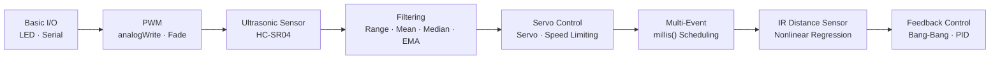

<div align="center">

# 🛠️ Creative Engineering Design

English | [한국어](README.ko.md)

**Arduino Coursework Archive**

A collection of weekly Arduino sketches — examples, exercises, and assignments — from a Creative Engineering Design course. Covers the progression from basic LED/PWM through ultrasonic and IR sensors, servo control, signal filtering, and feedback control (Bang-Bang & PID).

<br/>


-00599C?logo=cplusplus&logoColor=white)


</div>

---

## 📑 Table of Contents

- [About](#-about)
- [Hardware & Toolchain](#-hardware--toolchain)
- [Repository Layout](#-repository-layout)
- [Lessons Index](#-lessons-index)
- [Quick Start](#-quick-start)
- [Conventions](#-conventions)
- [Notes on Assignments](#-notes-on-assignments)
- [Disclaimer](#-disclaimer)
- [Author](#-author)

---

## 🧭 About

This repository archives weekly Arduino sketches (examples, exercises, and assignments) from a **Creative Engineering Design** undergraduate course. The course progression follows this flow:



> Each sketch is a single `.ino` file. Folder names encode the learning unit (week / example / assignment).

---

## 🔌 Hardware & Toolchain

| Item | Details |
|---|---|
| Board | Arduino UNO (ATmega328P, `arduino:avr:uno`) |
| Components | HC-SR04 ultrasonic sensor, Sharp IR distance sensor, SG90/MG-class servo, LED, potentiometer |
| Libraries | Standard `Arduino.h`, `Servo.h` (servo sketches only) |
| Serial Baud | Varies per sketch (`57600`, `115200`, `1000000`, `2000000`) |
| IDE | [Arduino IDE](https://www.arduino.cc/en/software) or [arduino-cli](https://arduino.github.io/arduino-cli/) |

> Pin assignments (LED 9, TRIG 12, ECHO 13, SERVO 10, IR A0, VAR A3, etc.) are declared in the `#define` block at the top of each sketch. Always check these before wiring.

---

## 🗂 Repository Layout

```
Creative_Engineering_Design/
├── 04_example_1/                # Digital output basics (LED)
├── 04_example_2/                # Serial output ("Hello World")
├── 04_example_3/                # LED toggle + counter
├── 05_practice_2/               # LED blink pattern exercise
├── pwmpractice/                 # PWM fade (analogWrite)
├── 08_example_1/                # Ultrasonic distance + LED
├── 08_example_2/                # millis()-based non-blocking sampling
├── 08_example_3/                # Running average filter
├── 08_assignment/               # Distance → LED brightness mapping (assignment)
├── 09_example_1/                # EMA (Exponential Moving Average) filter
├── 09_assignment_1/             # Median filter assignment (includes report PDF)
├── 10_example_1/                # Basic servo control
├── 11_example_1/                # Servo + ultrasonic distance mapping
├── 12_example_1/                # Multi-event scheduling
├── 13_example_1/                # Servo speed limiting (ramp)
├── 13_example_2/                # Servo speed limiting — tuning
├── 17_example_1/                # IR distance sensor + servo
├── 20_example_1/                # IR spike removal filter
├── 20_example_2/                # IR + EMA + nonlinear regression
├── 22_servo_range_adj/          # Servo calibration via potentiometer
├── 22_bangbangcontrol/
│   └── 22_bbc_20223165/         # Bang-Bang control implementation
├── 23_pid_P_only.ino            # PID control (P-term skeleton)
└── README.md
```

---

## 📚 Lessons Index

Click any folder/file link to jump to the corresponding sketch. Topics are conservatively inferred from folder names and code contents.

### Week 04 — Digital I/O & Serial Basics

| # | Folder / File | Topic | Key Concepts |
|---|---|---|---|
| 1 | [`04_example_1/`](./04_example_1/04_example_1.ino) | LED digital output | `pinMode`, `digitalWrite` |
| 2 | [`04_example_2/`](./04_example_2/04_example_2.ino) | Serial communication basics | `Serial.begin`, `Serial.println` |
| 3 | [`04_example_3/`](./04_example_3/04_example_3.ino) | LED toggle + counter | Function separation, even/odd toggle |

### Week 05 / PWM — Blink & Fade

| # | Folder / File | Topic | Key Concepts |
|---|---|---|---|
| 4 | [`05_practice_2/`](./05_practice_2/05_practice_2.ino) | LED blink pattern | Loops + `delay` |
| 5 | [`pwmpractice/`](./pwmpractice/pwmpractice.ino) | PWM fade | `analogWrite`, fade in/out |

### Week 08 — Ultrasonic (HC-SR04) Distance Measurement

| # | Folder / File | Topic | Key Concepts |
|---|---|---|---|
| 6 | [`08_example_1/`](./08_example_1/08_example_1.ino) | Distance + range LED | `pulseIn`, TRIG/ECHO, `delay`-based sampling |
| 7 | [`08_example_2/`](./08_example_2/08_example_2.ino) | Non-blocking sampling | `millis()`-based interval |
| 8 | [`08_example_3/`](./08_example_3/08_example_3.ino) | Running average filter | n-sample mean |
| 9 | [`08_assignment/`](./08_assignment/08_assignment.ino) | **Assignment** — Distance → LED brightness | `map()`, zone-based linear mapping |

### Week 09 — Signal Filtering

| # | Folder / File | Topic | Key Concepts |
|---|---|---|---|
| 10 | [`09_example_1/`](./09_example_1/09_example_1.ino) | EMA filter | Exponential Moving Average (`α`) |
| 11 | [`09_assignment_1/`](./09_assignment_1/09_assignment_1.ino) | **Assignment** — Median filter | Sort-based median, EMA comparison ([Report PDF](./09_assignment_1/06-09C1-20223165-%EA%B9%80%EC%9A%B0%ED%98%84.pdf)) |

### Week 10–13 — Servo Motors

| # | Folder / File | Topic | Key Concepts |
|---|---|---|---|
| 12 | [`10_example_1/`](./10_example_1/10_example_1.ino) | Basic servo control | `Servo.h`, `myservo.write()` |
| 13 | [`11_example_1/`](./11_example_1/11_example_1.ino) | Distance → servo angle mapping | EMA + `writeMicroseconds()` |
| 14 | [`12_example_1/`](./12_example_1/12_example_1.ino) | Multi-event scheduling | Separate intervals for dist/servo/serial |
| 15 | [`13_example_1/`](./13_example_1/13_example_1.ino) | Servo speed limiting | Angular velocity → duty delta conversion |
| 16 | [`13_example_2/`](./13_example_2/13_example_2.ino) | Speed limiting — low-speed tuning | `_SERVO_SPEED` threshold exploration |

### Week 17–20 — Infrared (IR) Distance Sensor

| # | Folder / File | Topic | Key Concepts |
|---|---|---|---|
| 17 | [`17_example_1/`](./17_example_1/17_example_1.ino) | IR + servo | EMA, IR distance conversion |
| 18 | [`20_example_1/`](./20_example_1/20_example_1.ino) | IR spike removal | Percentile-based median-like filter |
| 19 | [`20_example_2/`](./20_example_2/20_example_2.ino) | IR + EMA + regression | Nonlinear regression for voltage → distance |

### Week 22–23 — Feedback Control

| # | Folder / File | Topic | Key Concepts |
|---|---|---|---|
| 20 | [`22_servo_range_adj/`](./22_servo_range_adj/22_servo_range_adj.ino) | Servo calibration | Potentiometer input for duty correction |
| 21 | [`22_bangbangcontrol/22_bbc_20223165/`](./22_bangbangcontrol/22_bbc_20223165/22_bbc_20223165.ino) | Bang-Bang control | Target distance ± toggle |
| 22 | [`23_pid_P_only.ino`](./23_pid_P_only.ino) | PID control (P-term) — skeleton | Fill in `error`, `pterm`, `control` |

> 💡 `23_pid_P_only.ino` is a **fill-in-the-blank (`??`) learning template** and will not compile as-is. It is preserved as a course starting point.

---

## 🚀 Quick Start

### Option 1 — Arduino IDE

1. Install [Arduino IDE](https://www.arduino.cc/en/software) and connect the board via USB.
2. Select **Tools → Board → Arduino UNO** and choose the correct serial port.
3. Open the `.ino` file from the desired folder and click **Upload (✔→)**.
4. Open **Serial Monitor / Serial Plotter** and set the baud rate to the value defined at the top of the sketch.

### Option 2 — `arduino-cli`

```bash
# 1. Install core (first time only)
arduino-cli core update-index
arduino-cli core install arduino:avr

# 2. Compile
arduino-cli compile --fqbn arduino:avr:uno ./08_example_1

# 3. Upload (adjust port: macOS /dev/cu.usbmodem*, Linux /dev/ttyACM0, Windows COM3)
arduino-cli upload --fqbn arduino:avr:uno -p /dev/ttyACM0 ./08_example_1

# 4. Serial monitor
arduino-cli monitor -p /dev/ttyACM0 -c baudrate=57600
```

> ⚠️ **Hardware note**: Powering a servo from USB 5 V alone may cause insufficient current and board resets. Use an external power supply or a 5 V adapter with adequate capacity, and tie GND together.

---

## 🧩 Conventions

Common macros and naming conventions used across sketches:

| Macro | Meaning | Example |
|---|---|---|
| `PIN_LED` | LED pin (usually 9 or 13) | `#define PIN_LED 9` |
| `PIN_TRIG` / `PIN_ECHO` | HC-SR04 trigger / echo | `12 / 13` |
| `PIN_SERVO` | Servo signal | `10` |
| `PIN_IR` | IR distance sensor input | `A0` |
| `PIN_VAR` | Potentiometer input | `A3` |
| `_DUTY_MIN` / `_DUTY_NEU` / `_DUTY_MAX` | Servo pulse width (µs) | `553 / 1476 / 2399` (needs tuning) |
| `_DIST_MIN` / `_DIST_MAX` | Measurable distance range (mm) | `100 / 300` |
| `_EMA_ALPHA` | EMA weight (0–1) | `0.2` – `0.9` |
| `INTERVAL` / `_INTERVAL_*` | Non-blocking sampling period (ms) | `5`, `20`, `25`, `100` |

> Servo `_DUTY_*` values vary significantly between units. Calibrate with `22_servo_range_adj` whenever you swap servos.

---

## 📝 Notes on Assignments

<details>
<summary><b>08_assignment — Distance-Proportional LED Brightness</b></summary>

- In the 100 mm ≤ d ≤ 300 mm range, the LED is **dim at 150 mm / 250 mm edges and brightest at the 200 mm midpoint**, using zone-based `map()` for PWM output.
- Out-of-range values are replaced with the last valid measurement (`pre_distance`, `pre_brightness`).
</details>

<details>
<summary><b>09_assignment_1 — Median Filter</b></summary>

- Configured to compare raw, EMA, and Median outputs on the Serial Plotter with `SAMPLE_SIZE` set to 3 / 10 / 30.
- Sorting uses a simple insertion sort; large `SAMPLE_SIZE` values may increase processing time and conflict with the sampling interval.
- See the in-folder [`06-09C1-20223165-김우현.pdf`](./09_assignment_1/06-09C1-20223165-%EA%B9%80%EC%9A%B0%ED%98%84.pdf) report for results and analysis.
</details>

<details>
<summary><b>22_bbc — Bang-Bang Control</b></summary>

- Toggles servo duty between `_DUTY_NEU ± _BANGBANG_RANGE` based on a target distance (`dist_target = 155 mm`).
- Uses servo angular speed limiting (`_SERVO_SPEED`) to apply duty changes incrementally each interval.
</details>

<details>
<summary><b>23_pid_P_only — PID (Skeleton)</b></summary>

- A **course template** with `??` placeholders for `error_curr`, `pterm`, and `control`. It will not compile as-is.
- When filling in, establish a sign convention first, e.g., `error_curr = dist_target - dist_ema`.
</details>

---

## ⚠️ Disclaimer

The code and materials in this repository are **undergraduate coursework produced during class**.

- Not intended for industrial or safety-critical use.
- Some sketches (e.g., `23_pid_P_only.ino`) are intentionally incomplete learning templates.
- Pin numbers, duty values, and filter coefficients are tuned to specific hardware used in the course environment. **Recalibrate** before using with different hardware.

---

## 👤 Author

**Woohyun Kim** ([@mrpc2003](https://github.com/mrpc2003))
Creative Engineering Design student · Arduino / Embedded beginner.

<div align="center">

<sub>Made with ☕ + Arduino UNO · 2024</sub>

</div>
